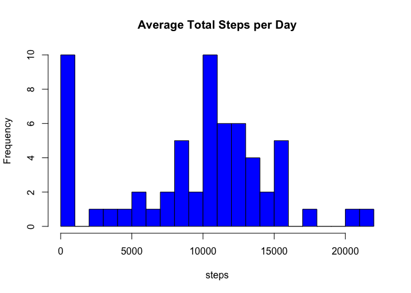
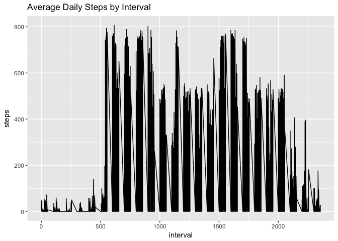
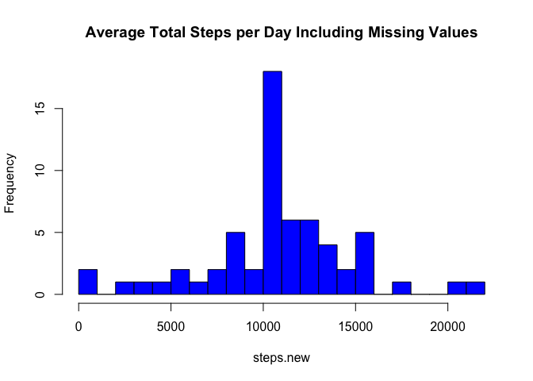
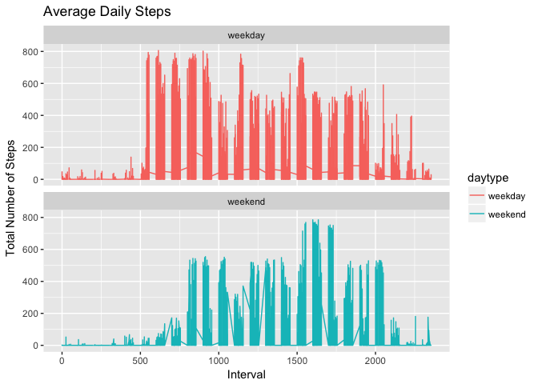

# Reproducible Research: Peer Assessment 1


## Loading and preprocessing the data

```r
unzip(zipfile="activity.zip")
data <- read.csv("activity.csv")
library(lubridate)
```

```
## 
## Attaching package: 'lubridate'
```

```
## The following object is masked from 'package:base':
## 
##     date
```

```r
library(dplyr)
```

```
## 
## Attaching package: 'dplyr'
```

```
## The following objects are masked from 'package:lubridate':
## 
##     intersect, setdiff, union
```

```
## The following objects are masked from 'package:stats':
## 
##     filter, lag
```

```
## The following objects are masked from 'package:base':
## 
##     intersect, setdiff, setequal, union
```

```r
data$date <- ymd(data$date)
```

## What is mean total number of steps taken per day?

```r
steps <- tapply(data$steps, data$date, FUN=sum, na.rm=TRUE)
hist(steps, col="blue", main="Average Total Steps per Day", breaks=25)
```

<!-- -->

```r
steps.mean <- mean(steps, na.rm=TRUE)
steps.mean
```

```
## [1] 9354.23
```

```r
steps.median <- median(steps, na.rm=TRUE)
steps.median
```

```
## [1] 10395
```

## What is the average daily activity pattern?


```r
library(ggplot2)
```

```
## Warning: package 'ggplot2' was built under R version 3.3.2
```

```r
steps.interval <- aggregate(data, by=list(data$interval, data$steps), FUN=mean, na.rm=TRUE)
ggplot(steps.interval, aes(x=interval, y=steps))+geom_line()+labs(title="Average Daily Steps by Interval")
```

<!-- -->


## Imputing missing values
Which 5-minute interval contains the maximum number of steps?

```r
max.interval <- steps.interval[which.max(steps.interval$steps),1]
print(max.interval)
```

```
## [1] 615
```
Calculate and report the total number of missing values

```r
missing <- sum(is.na(data))
print(missing)
```

```
## [1] 2304
```
Devise a strategy for filling in all missing values by using mean values indexed by interval and replacing nas

```r
data.new <- data
nas <- is.na(data.new)
avg.interval <- tapply(data.new$steps, data.new$interval, mean, na.rm=TRUE)
data.new[nas] <- avg.interval[as.character(data.new$interval[nas])]
```
Check for missing values on new data frame

```r
sum(is.na(data.new))
```

```
## [1] 0
```
Make a histogram of the new data set

```r
steps.new <- tapply(data.new$steps,data.new$date, FUN=sum, na.rm=TRUE)
hist(steps.new, col="blue", main="Average Total Steps per Day Including Missing Values", breaks=25)
```

<!-- -->

#Calculate mean and median daily steps for the new data set

```r
steps.mean2 <- mean(steps.new, na.rm=TRUE)
steps.mean2
```

```
## [1] 10766.19
```

```r
steps.median2 <- median(steps.new, na.rm=TRUE)
steps.median2
```

```
## [1] 10766.19
```

```r
steps.mean2-steps.mean
```

```
## [1] 1411.959
```

```r
steps.median2-steps.median
```

```
## [1] 371.1887
```
## Are there differences in activity patterns between weekdays and weekends?

```r
##steps.new2 <- aggregate(steps ~ date, data.new, sum, na.rm=TRUE)
data.new <- mutate(data.new, daytype=ifelse(weekdays(date)=="Saturday" | weekdays(date)=="Sunday", yes="weekend", no="weekday"))
```
Make a panel plot containing a time series plot of the 5-minute interval and the average number of steps taken, averaged across all weekday days or weekend days

```r
ggplot(data.new, aes(x=interval, y=steps, color=daytype))+geom_line()+
  labs(title="Average Daily Steps", x="Interval", y="Total Number of Steps")+
  facet_wrap(~daytype, ncol=1,nrow=2)
```

<!-- -->


